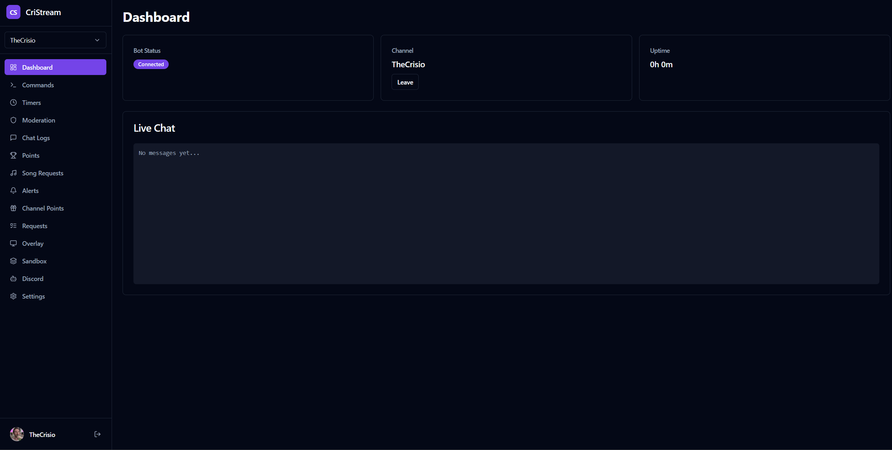
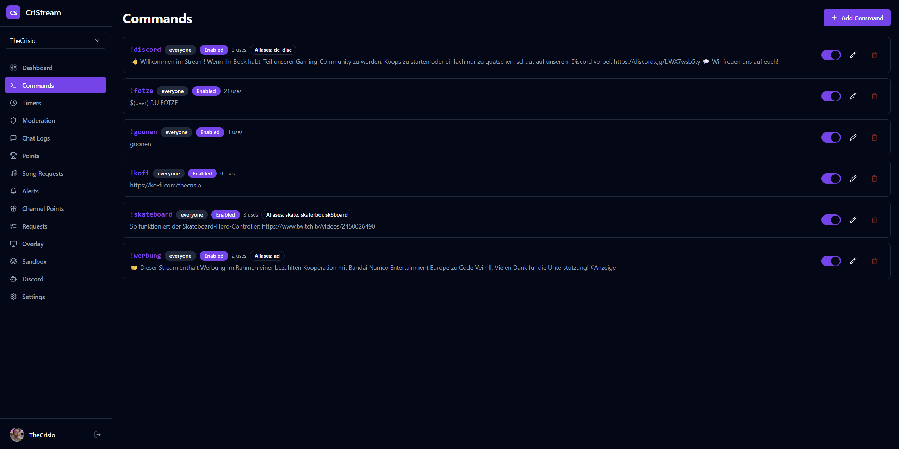
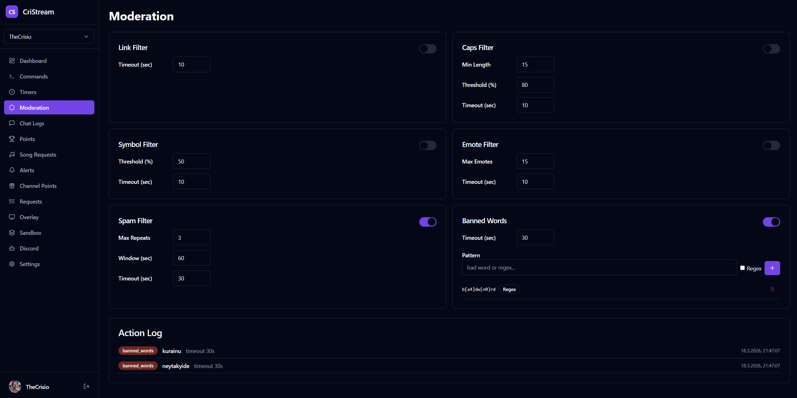
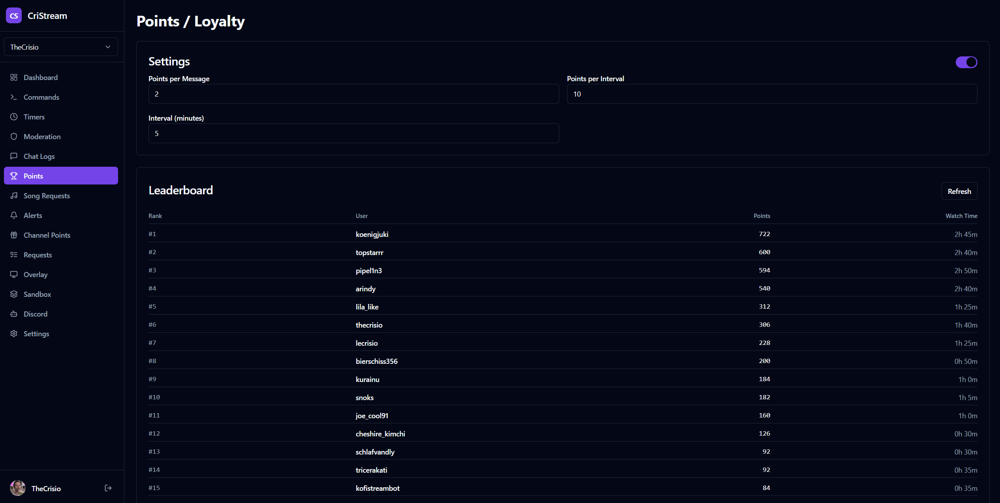
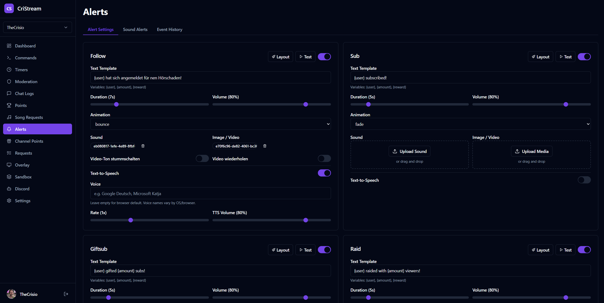
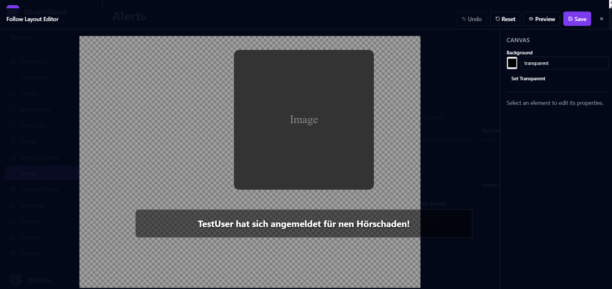
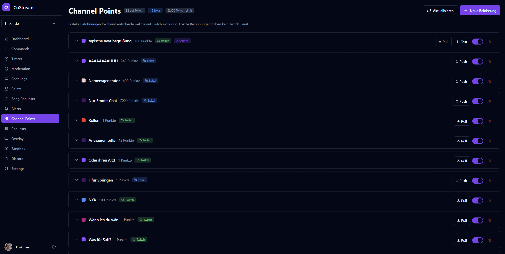

<p align="center">
  <h1 align="center">CriStream</h1>
  <p align="center">
    The self-hosted alternative to StreamElements, Streamlabs & Nightbot
    <br />
    Twitch bot, OBS overlays, alerts, channel points, Discord integration — fully Dockerized, own your data.
  </p>
  <p align="center">
    <a href="#features">Features</a> &middot;
    <a href="docs/SETUP.md">Installation</a> &middot;
    <a href="docs/CONFIGURATION.md">Configuration</a> &middot;
    <a href="docs/ROADMAP.md">Roadmap</a> &middot;
    <a href="https://ko-fi.com/thecrisio">Support on Ko-fi</a>
  </p>
</p>

---

## What is CriStream?

CriStream is a **self-hosted, open-source alternative to StreamElements, Streamlabs Cloudbot, and Nightbot**. Run it in Docker on your own server — no monthly fees, no data shared with third parties, full control over every feature.

Everything these cloud services offer (chat bot, alerts, overlays, loyalty points, song requests, channel points) — but self-hosted, customizable, and yours to keep.

## Features

### Chat Bot
- **Custom Commands** with variables (`$(user)`, `$(count)`, `$(game)`, `$(customapi.URL)`, ...)
- **Timers** — periodic messages with minimum chat line requirements
- **Auto-Moderation** — links, caps, symbols, emotes, spam, banned words (regex support)
- **Loyalty Points** — earn by chatting and watching, spend on sound alerts and song requests
- **Song Requests** — YouTube playback via `!sr` with queue management

### OBS Overlays (Browser Source)
- **Alert Overlay** — Follow, Sub, Gift Sub, Raid, Hype Train alerts with custom layouts
- **WYSIWYG Layout Editor** — drag & drop positioning for alert elements
- **Live Sandbox Overlay** — persistent overlay layer, controlled in real-time from the dashboard
- **Song Request Player** — YouTube player overlay
- **Polls & Predictions Widget** — live Twitch poll/prediction display with customizable styling

### Stream Management
- **Channel Points** — create custom rewards with actions (sound, alert, TTS, command, webhook)
- **EventSub** — real-time Twitch webhook events (follow, sub, raid, poll, prediction, ...)
- **Multi-Channel** — manage multiple Twitch channels from one dashboard
- **RBAC** — invite editors/viewers to help manage your channels
- **Viewer Requests** — let viewers submit feedback/requests via `!request`
- **Chat Logs** — searchable archive with platform filter (Twitch/Discord)
- **Event History** — audit log of all stream events

### Discord Integration
- Mirror commands and timers to Discord channels
- AI-powered chat summaries (Claude API)
- Stream event notifications (go live, new follower, sub, ...)
- `/deploy` and `/status` slash commands for server management

### Live Sandbox
- **Real-time WYSIWYG editor** — place text, images, and videos on your stream
- **No save button needed** — every change appears instantly on the OBS overlay
- **Stream preview** — see your live stream as the editor background for precise placement
- **Layer management** — z-index ordering, visibility toggles, duplicate, delete

## Tech Stack

| Component | Technology |
|-----------|-----------|
| Backend | Node.js, Fastify, Prisma, Socket.IO |
| Frontend | React 18, Vite, Tailwind CSS, Zustand |
| Database | PostgreSQL 16 |
| Cache | Redis 7 |
| Twitch | @twurple/api, @twurple/auth, @twurple/chat |
| Discord | discord.js 14 |
| Container | Docker, Docker Compose |

## Quick Start

### Prerequisites
- Docker & Docker Compose
- A [Twitch Developer Application](https://dev.twitch.tv/console/apps)
- A domain with HTTPS (for EventSub webhooks)

### 1. Clone & Configure

```bash
git clone https://github.com/CrisioDev/CriStream.git
cd CriStream
cp .env.example .env
```

Edit `.env` with your Twitch app credentials and secrets. See [Setup Guide](docs/SETUP.md) for details.

### 2. Start

```bash
docker compose up -d
```

This starts the app, PostgreSQL, and Redis. Migrations run automatically on first start.

### 3. Login

Open `https://your-domain.com`, click **Login with Twitch**, and authorize. Then click **Join Channel** on the Dashboard to activate the bot.

## Development

```bash
# Start DB + Redis
docker compose -f docker-compose.dev.yml up -d

# Install dependencies
pnpm install

# Generate Prisma client + run migrations
cd packages/backend && npx prisma generate && npx prisma migrate dev && cd ../..

# Build shared package
pnpm --filter @cristream/shared build

# Start backend (port 3000) + frontend (port 5173)
pnpm dev          # terminal 1
pnpm dev:frontend # terminal 2
```

## Project Structure

```
cristream/
├── docker/Dockerfile          # Multi-stage build
├── docker-compose.yml         # Production (app + postgres + redis)
├── docker-compose.dev.yml     # Development (postgres + redis only)
├── packages/
│   ├── shared/                # Shared types & constants
│   ├── backend/               # Fastify API, Twitch/Discord bots, overlays
│   │   ├── prisma/            # Database schema & migrations
│   │   └── src/modules/       # Feature modules (commands, alerts, ...)
│   └── frontend/              # React dashboard (SPA)
│       └── src/pages/         # Dashboard pages
└── scripts/deploy.sh          # Git-push deploy script
```

## Screenshots

### Dashboard


### Commands


### Auto-Moderation


### Loyalty Points & Leaderboard


### Alert Configuration


### WYSIWYG Alert Layout Editor


### Channel Points Rewards


## Support

If you find CriStream useful, consider supporting development:

<a href="https://ko-fi.com/thecrisio">
  
</a>

## License

MIT
